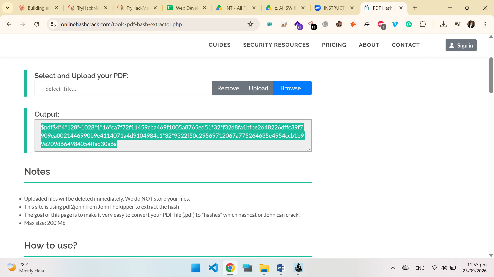
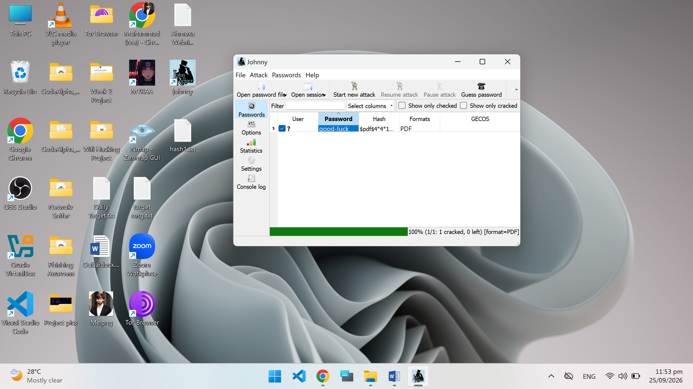
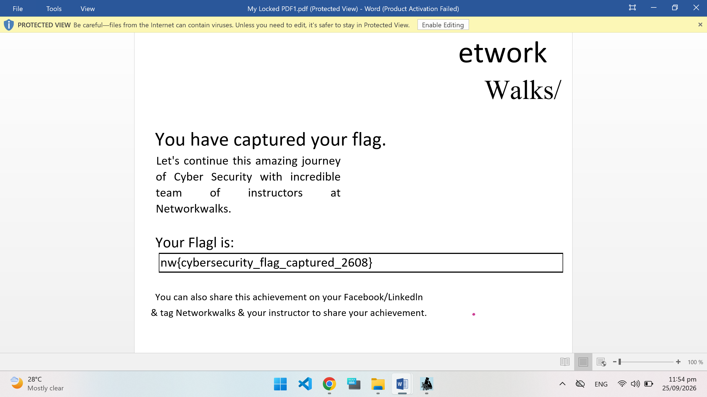

# PDF Password Cracking using John the Ripper & Johnny (GUI)

**Author:** Muhammad Ahmad

## 📌 Overview
This project documents a hands-on cybersecurity lab completed as part of the **Networkwalks Cyber Security Training**. The objective was to crack the password of a protected PDF file using **John the Ripper (JTR)** along with its GUI front-end **Johnny**.

## 🎯 Objective
- Extract the password hash from a locked PDF file.
- Perform a password-cracking attack using John the Ripper / Johnny.
- Successfully recover the password and capture the lab flag.

## 🛠️ Tools Used
- **John the Ripper (JTR)** – password cracking tool
- **Johnny** – GUI for John the Ripper
- **pdf2john** – utility to extract crackable hash from a PDF file
- **Online Hash Crack (PDF Hash Extractor)** – used to generate the PDF hash

## 🔍 Steps Performed

### 1. Hash Extraction
The password-protected PDF was processed to extract its hash using a `pdf2john`-based tool, producing a hash in the `$pdf$...` format required by John the Ripper.

### 2. Running the Attack
The extracted hash was loaded into **Johnny** (GUI for John the Ripper), and a new attack was started against the PDF hash.

### 3. Password Cracked
The attack completed successfully — **1/1 hash cracked** — recovering the PDF's password. The PDF was then opened using the cracked password, revealing the challenge flag.

## 🏁 Result
✅ Password successfully cracked
✅ Flag captured: `nw{cybersecurity_flag_captured_2608}`

## 📚 Key Takeaways
- Learned how PDF encryption can be attacked when weak passwords are used.
- Understood the workflow of extracting a crackable hash from a document and feeding it into John the Ripper.
- Gained practical, hands-on experience with password auditing tools used in penetration testing.

## ⚠️ Disclaimer
This project was completed strictly for **educational purposes** as part of a structured cybersecurity training lab. The techniques shown here should only be used on files/systems you own or have explicit authorization to test.

---
*Part of the Networkwalks Cyber Security learning journey.*
